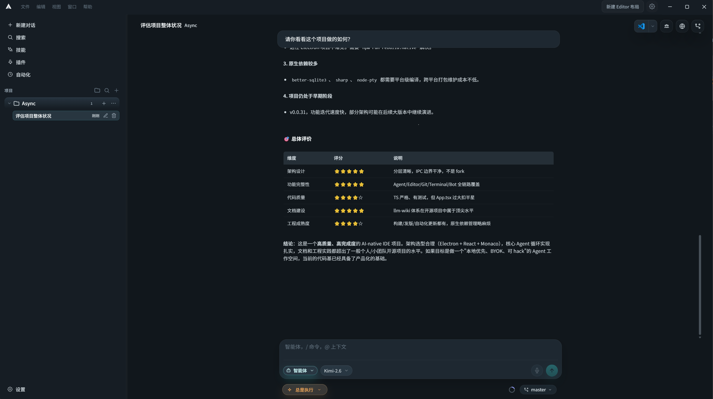
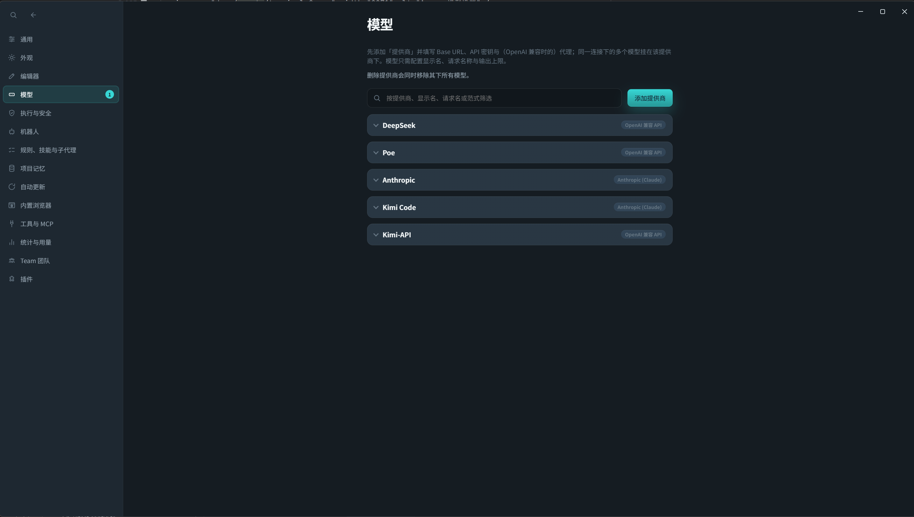
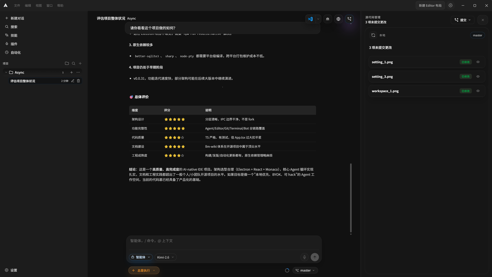
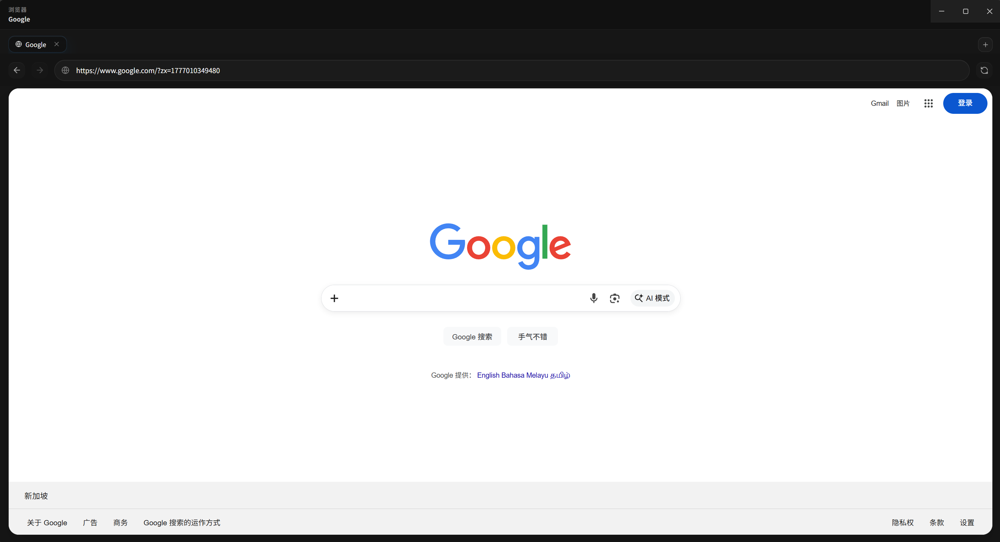
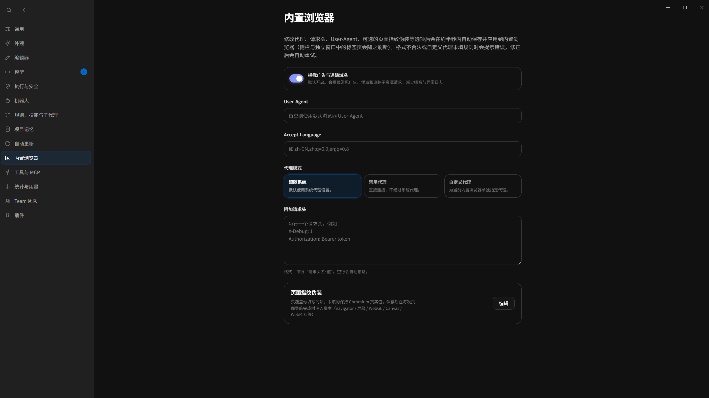
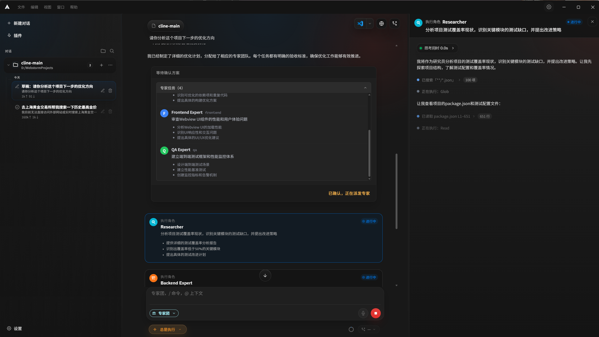
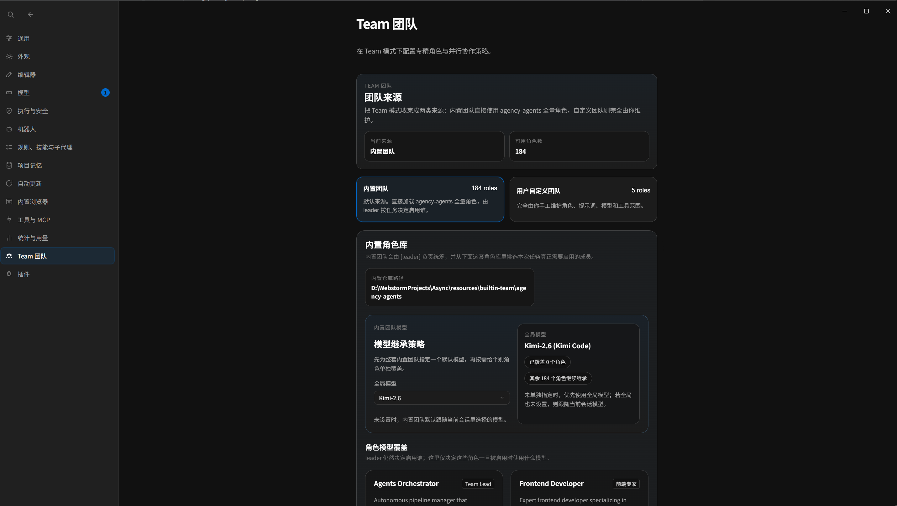
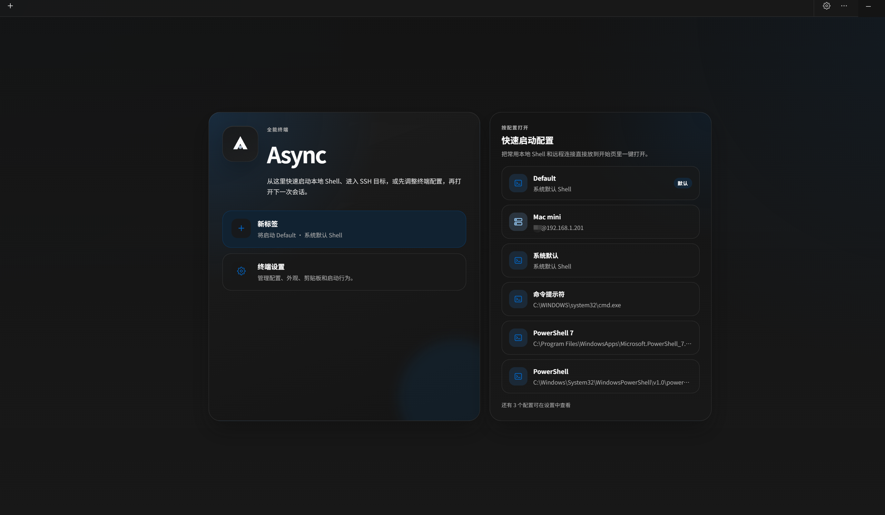
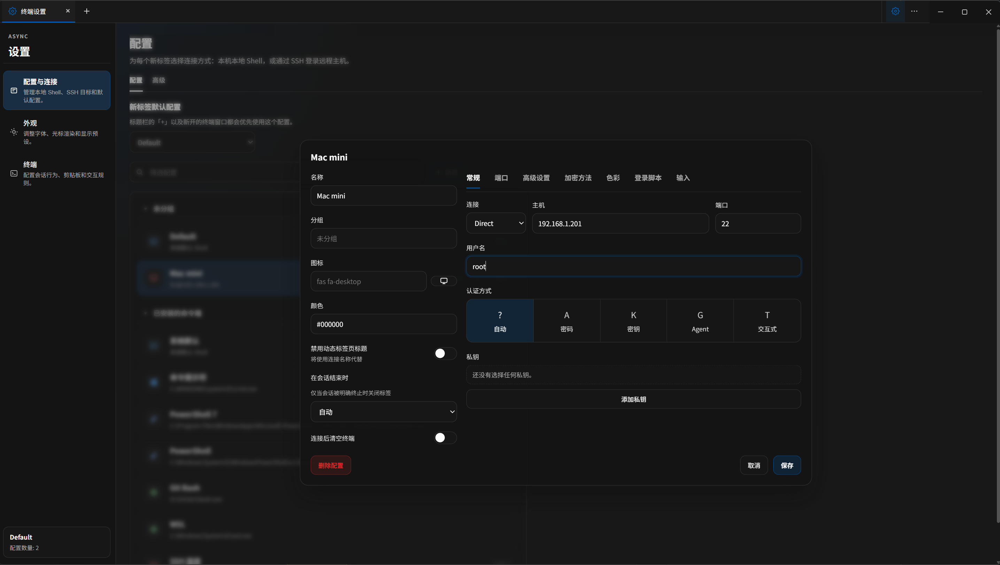
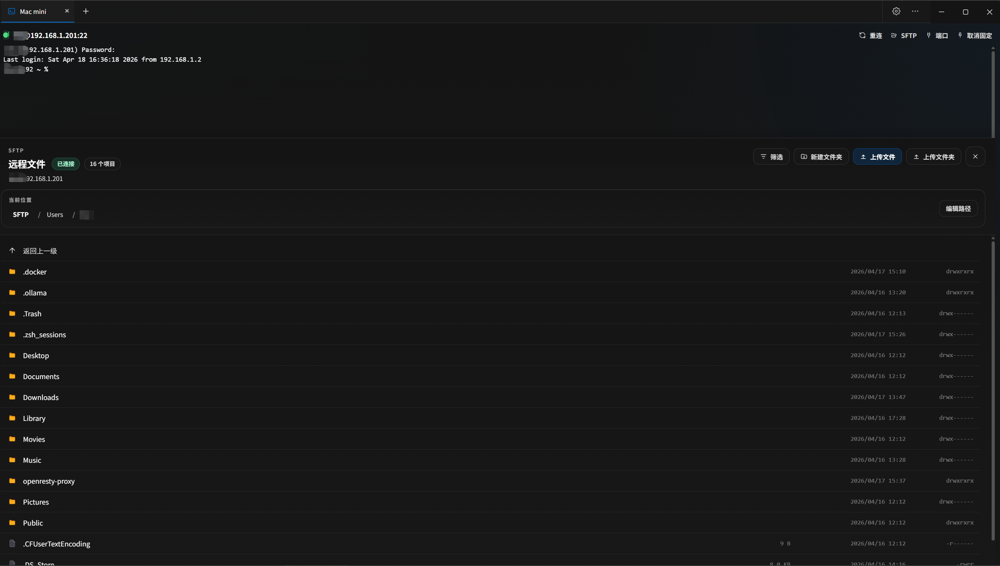

# Async IDE

<p align="center">
  
</p>

<p align="center">
  <strong>开源的 Agent-first 桌面工作区 —— Agent、编辑器、Git、终端，一体成型。</strong><br/>
  本地优先、自带模型、完全可控，你的 AI 工作流由你自己做主。
</p>

<p align="center">
  
  
  
  
  
  
</p>

<p align="center">
  <a href="README.md">English</a> | <a href="README.zh-CN.md">简体中文</a>
</p>

---

## Async IDE 是什么？

Async IDE 是一款基于 **Electron + React + Monaco 从零搭建**的 AI 原生桌面 Shell。它不是 VS Code 分支——整个代码库刻意保持精简、透明、可随意改动。

核心理念很简单：**Agent 才是中心**，而不是编辑器侧边缝上去的聊天插件。工作区访问、工具执行、Diff 审阅、终端操作——所有一切都围绕一个透明的 **思考 → 规划 → 执行 → 观察** 闭环展开，每一步你都能看见、能干预、能随时叫停。

- **Apache 2.0** • 模型接入 **BYOK** • 数据默认 **本地优先**

---

## 核心亮点

- **Agent 优先闭环** —— 自主多轮工具执行，流式参数卡片（`Read`、`Write`、`Edit`、`Glob`、`Grep`、Shell 等）实时展示，敏感操作带审批门控。
- **四种 Composer 模式** —— **Agent**（全自主）、**Plan**（先审后跑）、**Ask**（只读问答）、**Debug**（系统排查）。
- **Team 模式** —— 多 Agent 协作：Lead 规划、Specialist 执行、Reviewer 审验，支持计划审批与工作流编排。
- **多模型多厂商** —— Anthropic、OpenAI、Gemini，以及任意 OpenAI-compatible 端点（Ollama、vLLM、自建服务），支持自动选模。
- **Git 原生集成** —— 状态、Diff、暂存、提交、推送一站式 UI 操作；Agent 改动与真实仓库实时同步。
- **IM 机器人桥接** —— **Telegram**、**Slack**、**Discord**、**飞书** 接入与桌面端同一套 Agent / Team 编排能力，可按集成配置模型、工作区、白名单。
- **内置工具箱** —— 浏览器自动化（自定义请求头 / 指纹）、LSP 编辑器智能、MCP 服务器支持、文件索引与符号搜索、用户与 Agent 共享的全能终端。
- **本地私密** —— 对话、设置、计划全部落在本地，无云端锁定。

---

## 界面预览

### Agent 布局
<p align="center">
  
</p>

### 模型设置
<p align="center">
  
</p>

### 外观调色盘
<p align="center">
  
</p>

#### Mac Codex 主题
<p align="center">
  
</p>

### 浏览器工具调用（AI 可自动模拟请求头 + 指纹伪装）
<p align="center">
  
</p>

<p align="center">
  
</p>

### 多 Agent 协作专家团
<p align="center">
  
</p>

<p align="center">
  
</p>

### 通过外部机器人以对话方式控制整个应用
<p align="center">
  
</p>

### 全能终端（内部命令可被 Agent 和机器人直接调用）
<p align="center">
  
</p>

<p align="center">
  
</p>

<p align="center">
  
</p>

---

## 核心特性

### 自主 Agent 循环
- 工具参数流式展示，配合轨迹卡片，执行过程一目了然。
- Plan / Agent 双模式：可以先看计划再执行，也可以直接让 Agent 开跑。
- Shell 命令和文件写入支持审批门控。
- Agent 改代码时可联动编辑器定位到对应文件和行范围。
- 支持嵌套子 Agent、后台执行和时间线式活动展示。

### 多模型支持
- 内置 Anthropic、OpenAI、Gemini 适配。
- 支持兼容 OpenAI 接口的各种端点，如 Ollama、vLLM、聚合 API、自建服务。
- 在支持的模型上展示流式思考块。
- Auto 模式自动挑选当前最合适的模型。

### 开发体验
- Monaco 编辑器，支持多标签页、语法高亮和 Diff 审阅流程。
- Git 集成：状态、Diff、暂存、提交、推送都能在 UI 里完成。
- xterm.js 终端：既能自己用，也能观察 Agent 触发了什么 Shell 操作。
- Composer 支持 `@` 文件引用、多段消息和线程持久化。
- 快速打开（`Ctrl/Cmd+P`）和整体键盘优先的交互。
- 内置中英文国际化。
- 支持本地 disk skills、工作区配置合并和工具审批控制。

### IM / 机器人接入
除了桌面 Composer，Async 也可以作为外部聊天面上的 **Agent 宿主**。

- **支持平台** —— Telegram、Slack、Discord、飞书，适配代码在 `main-src/bots/platforms/`。
- **同一套运行时** —— 外部消息由 `botRuntime` 驱动：普通会话走 `agentLoop`；Team 模式则与桌面端一致，走 `teamOrchestrator`（含子 Agent 流式增量与工具状态等）。
- **按集成配置** —— 开关、名称、默认模型、默认 Composer 模式（`agent` / `ask` / `plan` / `team`）、工作区根目录（可多选）、可选会话/用户白名单，以及附加系统提示词（叠在项目规则之上）。
- **网络与代理** —— 各平台可单独配置 HTTP 代理 URL，便于在企业网络下访问厂商 API / Webhook。
- **飞书** —— 应用凭证、可选加解密、流式互动卡片展示长任务进度；集成配置变更时会清理相关会话状态，避免串会话。
- **界面入口** —— 设置 → 机器人（`SettingsBotsPanel.tsx`）。

更细的模块说明见维护者向文档 [`docs/llm-wiki/`](./docs/llm-wiki/)。

---

## 技术架构

```text
┌─────────────────────────────────────────────────────────┐
│                      渲染进程                           │
│  React + Vite  │  Monaco 编辑器  │  xterm.js 终端      │
│  Composer / Chat / Plan / Agent UI                     │
└──────────────────────────┬──────────────────────────────┘
                           │  contextBridge（IPC）
┌──────────────────────────▼──────────────────────────────┐
│                       主进程                            │
│  agentLoop.ts  │  toolExecutor.ts  │  LLM 适配器       │
│  gitService    │  threadStore      │  settingsStore    │
│  workspace     │  LSP 会话         │  PTY 终端         │
└─────────────────────────────────────────────────────────┘
```

### 技术栈

| 技术 | 版本 | 用途 |
|------|------|------|
| **React** | ^19.2.4 | UI 框架 |
| **Electron** | 41.1.0 | 桌面应用外壳 |
| **Vite** | ^6.0.3 | 构建工具与开发服务器 |
| **TypeScript** | ^5.9.3 | 类型安全开发 |
| **Monaco Editor** | ^0.52.0 | 代码编辑器组件 |
| **xterm.js** | ^5.5.0 | 终端模拟器 |
| **OpenAI SDK** | ^4.96.0 | OpenAI API 客户端 |
| **Anthropic SDK** | ^0.39.0 | Claude API 客户端 |
| **Google Generative AI** | ^0.21.0 | Gemini API 客户端 |
| **MCP SDK** | ^1.29.0 | Model Context Protocol |
| **node-pty** | ^1.1.0 | PTY 终端支持 |

- **从零搭建**：Electron + React + Monaco，不是 VS Code 分支。架构刻意保持精简——双进程（主进程 + 渲染进程）、清晰的 IPC 边界、没有需要维护的继承插件生态。
- `agentLoop.ts` 负责多轮工具调用、流式 JSON 片段、工具修复和中止控制。
- Assistant 消息支持结构化持久化，需要时再展开成不同模型原生的 tool 格式。
- 线程、设置、计划等数据默认以 JSON / Markdown 形式落在本地。
- `gitService` 提供 UI 用到的 Git 操作层。
- LSP 目前接入了 TypeScript Language Server。

## 项目结构

```text
Async/
├── main-src/                  # 主进程源码，最终打包到 electron/main.bundle.cjs
│   ├── index.ts               # 应用入口：窗口、userData、IPC 注册
│   ├── agent/                 # agentLoop.ts、toolExecutor.ts、agentTools.ts 等
│   ├── llm/                   # OpenAI / Anthropic / Gemini 适配器与流式处理
│   ├── lsp/                   # TypeScript LSP 会话
│   ├── mcp/                   # Model Context Protocol 集成
│   ├── memdir/                # 记忆目录管理
│   ├── bots/                  # IM 机器人：控制器、运行时、连通性检测、各平台适配器
│   ├── ipc/register.ts        # 核心 IPC 处理（聊天、线程、Agent、Plan）
│   ├── ipc/handlers/          # 分域 IPC 处理（Git、文件系统、MCP、设置等）
│   ├── shell/                 # Shell 命令执行
│   ├── threadStore.ts         # 线程与消息持久化
│   ├── settingsStore.ts       # settings.json 管理
│   ├── gitService.ts          # Git 状态、Diff、提交、推送
│   ├── workspace.ts           # 工作区根目录与安全路径解析
│   ├── workspaceFileIndex.ts  # 工作区文件索引
│   ├── workspaceSymbolIndex.ts    # 符号索引
│   └── workspaceUsageStats.ts     # 工作区使用统计
├── src/                       # 渲染进程（Vite + React）
│   ├── App.tsx                # 主界面、聊天、Composer 模式、Git / 文件树
│   ├── AgentChatPanel.tsx     # Agent 聊天界面
│   ├── AgentLeftSidebar.tsx   # Agent 活动侧边栏
│   ├── AgentRightSidebar.tsx  # Agent 工具和结果
│   ├── ChatComposer.tsx       # 消息编辑器组件
│   ├── EditorMainPanel.tsx    # Monaco 编辑器面板
│   ├── SettingsPage.tsx       # 设置界面
│   ├── SettingsBotsPanel.tsx  # IM 机器人集成（Telegram / Slack / Discord / 飞书）
│   ├── WorkspaceExplorer.tsx  # 文件浏览器
│   ├── hooks/                 # 自定义 React hooks
│   ├── i18n/                  # 中英文文案
│   └── ...                    # Agent UI、Plan 审阅、Monaco、终端等组件
├── electron/
│   ├── main.bundle.cjs        # esbuild 产物，不建议手改
│   └── preload.cjs            # 预加载脚本 -> window.asyncShell
├── docs/assets/               # Logo、截图
├── scripts/
│   └── export-app-icon.mjs    # SVG -> PNG 图标导出
├── esbuild.main.mjs           # 主进程构建脚本
├── vite.config.ts             # 渲染进程构建配置
└── package.json
```

## 数据存储

默认位于 Electron 的 `userData` 目录下：

- `async/threads.json`：线程和聊天消息。
- `async/settings.json`：模型配置、密钥、布局、Agent 选项，以及机器人集成配置。
- `.async/plans/`：Plan 模式生成的 Markdown 计划文件。

渲染进程可能会用 `localStorage` 存一些轻量 UI 状态，但对话的权威数据源还是 `threads.json`。

---

## 快速开始

### 环境要求

- **Node.js** >= 18
- **npm** >= 9
- **Git**（建议安装）

### 安装与运行

```bash
git clone https://github.com/ZYKJShadow/Async.git
cd Async
npm install
npm run desktop
```

如果你更习惯 Gitee：

```bash
git clone https://gitee.com/shadowsocks_z/Async.git
cd Async
npm install
npm run desktop
```

### 开发模式

```bash
npm run dev          # 带热重载的开发服务器
npm run dev:debug    # 同上，并打开 DevTools
npm run icons        # 从 SVG 生成应用图标
```

---

## 致谢

感谢开源社区以及 Claude Code 等项目对 Agent 驱动开发的推动——Async IDE 在此基础上探索了属于自己的透明化、本地优先的 AI 工作流。

---

## 社区交流

有问题、有想法，或者就是想和一群搞开发的人聊聊？

- **论坛**：[linux.do](https://linux.do/) —— 来这里讨论、分享你的配置、反馈问题，欢迎常驻。

---

## 许可证

本项目基于 [Apache License 2.0](./LICENSE) 协议开源。
